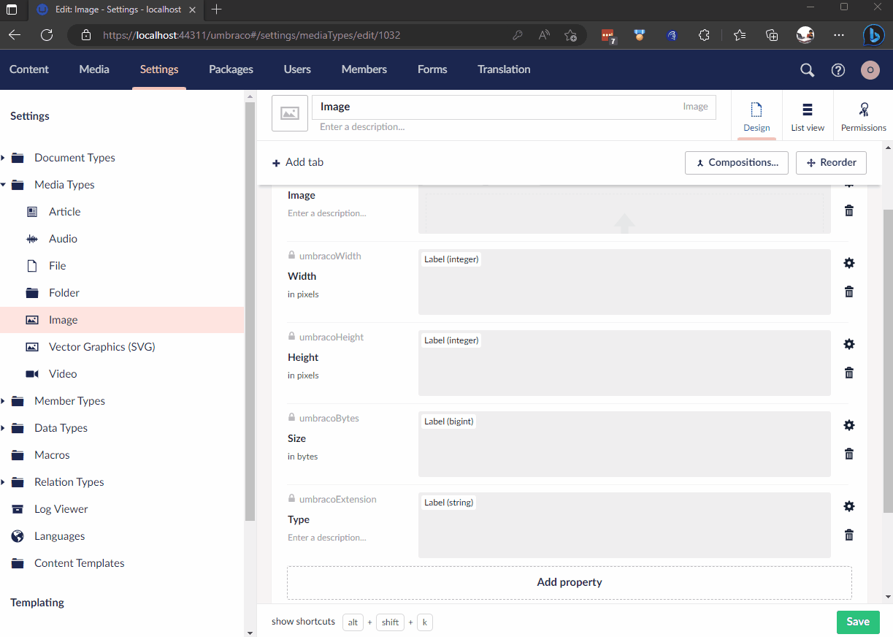
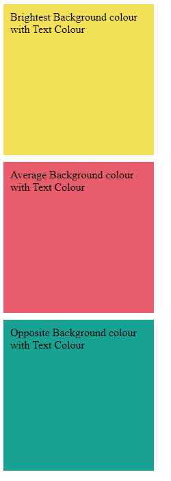

# Our.Community.MediaColourFinder


[](https://www.nuget.org/packages/Umbraco.Community.MediaColourFinder/)
[](https://www.nuget.org/packages/Umbraco.Community.MediaColourFinder/)
[](LICENSE)


With this Umbraco CMS package, you can now add a new custom property editor to your uploaded images. This feature enables you to use the focal point of an image to obtain its brightest color, average color, and opposite color to the brightest.

You can then use these colours in your website build to enhance your designs.


<!--
Including screenshots is a really good idea! 

If you put images into /docs/screenshots, then you would reference them in this readme as, for example:


-->

## Installation

Add the package to an existing Umbraco website (v10.4+) from nuget:

`dotnet add package Umbraco.Community.Our.Community.MediaColourFinder`

* Once you have the package installed, you need to add the Media Colour Finder property to your Image media type.



* You can then open up a media item and save it and you will see the colours shown in the property editor. You can change the colours by moving the focal point on the image. As demonstrated in the video above. 

* You can access the values from this property editor like this : 

```
@if (Model.BannerImage != null)
{
    var image = Model.BannerImage.Content as Image;
    if(image != null)
    {
         <div style="height: 200px; width: 200px; background-color: @image.Colours?.Brightest.ToString(); padding: 10px; margin-bottom: 10px;">
                <span style="color: @image.Colours?.TextColour">Brightest Background colour with Text Colour</span>
         </div>

            <div style="height: 200px; width: 200px; background-color: @image.Colours?.Average.ToString(); padding: 10px; margin-bottom: 10px;">
                <span style="color: @image.Colours?.TextColour">Average Background colour with Text Colour</span>
            </div>

            <div style="height: 200px; width: 200px; background-color: @image.Colours?.Opposite.ToString(); padding: 10px;">
                <span style="color: @image.Colours?.TextColour">Opposite Background colour with Text Colour</span>
            </div>
    }
   
}
```

This assumes that you've added an Image Picker on to the page you want to render on thhe front end and called it `Banner Image`. You can then access the property on your Image type via it's alias. In this example I've called it `Colours`.

The code above will display something like this : 





## Contributing

Contributions to this package are most welcome! Please read the [Contributing Guidelines](CONTRIBUTING.md).

## Acknowledgments

<a href="https://www.flaticon.com/free-icons/color" title="color icons">Color icons created by Nikita Golubev - Flaticon</a>
